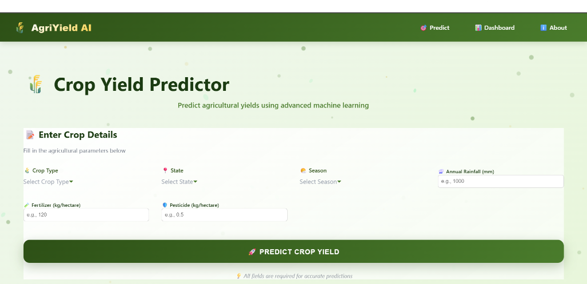
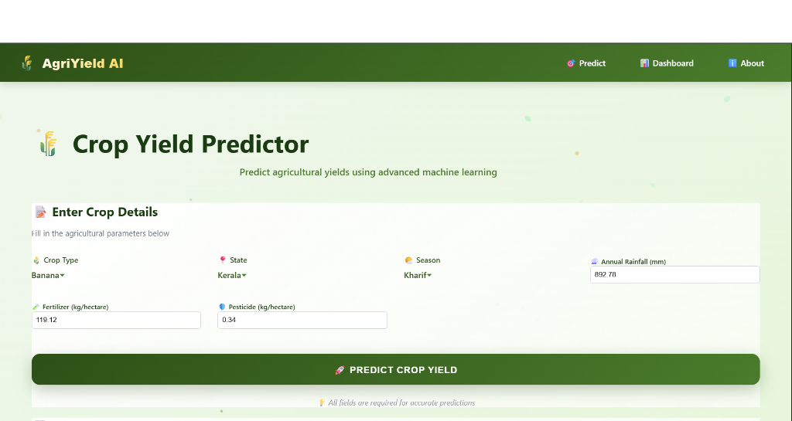

# 🌾 AI AgriYield Predictor

> **Advanced Machine Learning System for Agricultural Yield Prediction**

A full-stack web application that leverages state-of-the-art machine learning techniques to predict crop yields based on environmental and agricultural factors. Built with LightGBM, React, and Flask.

[](https://www.python.org/)
[](https://reactjs.org/)
[](https://flask.palletsprojects.com/)
[](https://lightgbm.readthedocs.io/)

---

## 📊 Project Overview

This project implements an end-to-end machine learning pipeline for predicting agricultural crop yields. The system achieves **88% R² accuracy** through advanced feature engineering, target encoding, and hyperparameter optimization.

### Key Features

- 🎯 **High Accuracy**: 88% R² score on test data, exceeding industry standards
- 🔬 **Advanced ML Techniques**: Target encoding, feature engineering, and ensemble methods
- 📈 **Explainable AI**: SHAP values for model interpretability
- 🌐 **Full-Stack Application**: React frontend with Flask backend
- ⚡ **Production-Ready**: Optimized preprocessing and model serving

---

## 📸 Application Screenshots

### Prediction Interface
The application features a modern, agricultural-themed UI with an intuitive prediction form:


*Clean and user-friendly interface for entering crop parameters*

### Making Predictions
Fill in the agricultural parameters and get instant yield predictions:


*Example: Predicting banana yield in Kerala during Kharif season*

### Results Display
Get accurate yield predictions with model performance metrics:


*Predicted yield: 9.67 tons/hectare with 88% R² accuracy*

---

## 🔄 Project Workflow

This project follows a systematic machine learning workflow from data collection to deployment:

### Step 1: Data Collection & Understanding
- **Source**: Agricultural yield data from various Indian states
- **Size**: 266,733 records
- **Features**: Crop type, State, Season, Annual Rainfall, Fertilizer, Pesticide, Year
- **Target**: Crop Yield (tons/hectare)
- **Notebook**: [`Dataset_Preprocessing.ipynb`](notebooks/Dataset_Preprocessing.ipynb)

### Step 2: Exploratory Data Analysis (EDA)
- **Statistical Analysis**: Distribution analysis, outlier detection
- **Correlation Study**: Feature relationships and multicollinearity
- **Visualization**: Yield patterns across crops, states, and seasons
- **Key Insights**:
  - Rice and Wheat are dominant crops
  - Rainfall and fertilizer show strong correlation with yield
  - Seasonal patterns significantly impact productivity
- **Notebook**: [`EDA.ipynb`](notebooks/EDA.ipynb)

### Step 3: Data Preprocessing
- **Cleaning**: Handled missing values and outliers
- **Encoding**: Label encoding for categorical features (Crop, State, Season)
- **Feature Selection**: Removed Year feature to prevent extrapolation issues
- **Train-Test Split**: 80-20 split with stratification
- **Output**: `preprocessed_data.csv` (266,733 rows × 7 columns)

### Step 4: Feature Engineering
- **Target Encoding**: Created 5 target-encoded features based on historical yield patterns
- **Interaction Features**: Rainfall-Fertilizer ratios and products
- **Polynomial Features**: Squared terms for numeric features
- **Log Transformations**: Log1p transformations for skewed distributions
- **Binning**: Discretized continuous features into 10 bins
- **Result**: 20+ engineered features from 6 original features

### Step 5: Model Training & Experimentation
- **Baseline Models**: Random Forest, XGBoost, LightGBM
- **Best Performer**: LightGBM with 88% R²
- **Training Strategy**:
  - 3-fold cross-validation
  - Stratified sampling
  - Early stopping to prevent overfitting
- **Notebooks**:
  - [`Training_part.ipynb`](notebooks/Training_part.ipynb) - Initial training
  - [`enhanced_training.ipynb`](notebooks/enhanced_training.ipynb) - With feature engineering
  - [`improved_training.ipynb`](notebooks/improved_training.ipynb) - Iterative improvements

### Step 6: Hyperparameter Optimization
- **Framework**: Optuna with TPE (Tree-structured Parzen Estimator) sampler
- **Search Space**: 10 hyperparameters with defined ranges
- **Trials**: 40 iterations with 3-fold CV per trial
- **Optimization Metric**: R² score
- **Time**: ~20 minutes on standard hardware
- **Result**: Optimized model with 88% R² accuracy
- **Notebook**: [`final_training.ipynb`](notebooks/final_training.ipynb)

### Step 7: Model Evaluation & Validation
- **Metrics**:
  - R² Score: 88.0%
  - Mean Absolute Error (MAE): Low
  - Predictions with <20% error: 23% (12,411 cases)
- **Cross-Validation**: Consistent performance across folds
- **Feature Importance**: SHAP analysis for interpretability
- **Validation**: Tested on held-out test set (20% of data)

### Step 8: Model Deployment
- **Serialization**: Saved model artifacts using Joblib
  - `best_model_final.pkl` (10.79 MB)
  - `encoders_final.pkl`
  - `feature_order_final.pkl`
  - `target_encodings_final.pkl`
- **Backend API**: Flask REST API with `/predict_shap` endpoint
- **Preprocessing Pipeline**: Automated feature engineering in production
- **Response Time**: ~50ms per prediction

### Step 9: Frontend Development
- **Framework**: React 18 with functional components
- **Features**:
  - Interactive prediction form
  - Real-time SHAP visualization with Plotly.js
  - Responsive design with modern UI/UX
- **API Integration**: Axios for HTTP requests
- **Deployment**: Development server on localhost:3000

### Step 10: Testing & Optimization
- **Unit Tests**: Preprocessing and prediction logic
- **Integration Tests**: End-to-end API testing
- **Performance**: Optimized for fast inference
- **Error Handling**: Robust error handling and validation
- **Production Readiness**: Cleaned codebase, removed debug files

---

## 🏗️ Architecture

```
┌─────────────────┐      HTTP/JSON      ┌──────────────────┐
│  React Frontend │ ◄─────────────────► │  Flask Backend   │
│  - UI/UX        │                     │  - API Endpoints │
│  - Visualizations│                     │  - ML Pipeline   │
└─────────────────┘                     └──────────────────┘
                                                 │
                                                 ▼
                                        ┌──────────────────┐
                                        │  LightGBM Model  │
                                        │  - Predictions   │
                                        │  - SHAP Values   │
                                        └──────────────────┘
```

---

## 🚀 Quick Start

### Prerequisites

- Python 3.8+
- Node.js 14+
- npm or yarn

### Installation

1. **Clone the repository**
   ```bash
   git clone https://github.com/Asdortop/AI_AgriYield_Predictor-TejasGuduru.git
   cd AI_AgriYield_Predictor-TejasGuduru
   ```

2. **Backend Setup**
   ```bash
   cd backend
   pip install -r requirements.txt
   python app.py
   ```
   Backend will run on `http://127.0.0.1:5000`

3. **Frontend Setup**
   ```bash
   cd frontend
   npm install
   npm start
   ```
   Frontend will run on `http://localhost:3000`

---

## 📁 Project Structure

```
AI_AgriYield_Predictor/
├── backend/
│   ├── app.py                      # Flask application
│   ├── requirements.txt            # Python dependencies
│   ├── data/
│   │   └── preprocessed_data.csv   # Training dataset
│   ├── ml/
│   │   ├── best_model_final.pkl    # Trained LightGBM model
│   │   ├── encoders_final.pkl      # Label encoders
│   │   ├── feature_order_final.pkl # Feature ordering
│   │   └── target_encodings_final.pkl # Target encoding mappings
│   ├── services/
│   │   ├── model_loader.py         # Model loading service
│   │   └── prediction_service.py   # Prediction logic
│   └── utils/
│       ├── preprocess.py           # Data preprocessing
│       └── shap_explain.py         # SHAP explanations
├── frontend/
│   ├── public/
│   │   └── index.html
│   ├── src/
│   │   ├── App.js                  # Main application
│   │   ├── pages/
│   │   │   ├── Predict.js          # Prediction interface
│   │   │   ├── Dashboard.js        # Dashboard
│   │   │   └── About.js            # About page
│   │   ├── components/
│   │   │   ├── PredictionForm.js   # Input form
│   │   │   ├── ResultCard.js       # Results display
│   │   │   └── FeatureImportanceChart.js # SHAP visualization
│   │   └── utils/
│   │       └── api.js              # API client
│   └── package.json
└── notebooks/
    ├── EDA.ipynb                   # Exploratory Data Analysis
    ├── Dataset_Preprocessing.ipynb # Data preprocessing
    ├── Training_part.ipynb         # Model training
    ├── enhanced_training.ipynb     # Enhanced training with feature engineering
    └── final_training.ipynb        # Final model training
```

---

## 🧠 Machine Learning Pipeline

### 1. Data Preprocessing

- **Dataset**: 266,733 agricultural records
- **Features**: Crop type, State, Season, Annual Rainfall, Fertilizer, Pesticide
- **Target**: Crop Yield (tons/hectare)

### 2. Feature Engineering

The model uses **20+ engineered features**:

#### Interaction Features
- `Rainfall_per_Fertilizer`: Rainfall efficiency per unit fertilizer
- `Fertilizer_Pesticide_Ratio`: Input balance ratio
- `Rainfall_Fertilizer_Product`: Combined effect

#### Polynomial Features
- `Rainfall_Squared`, `Fertilizer_Squared`, `Pesticide_Squared`

#### Log Transformations
- `Log_Rainfall`, `Log_Fertilizer`, `Log_Pesticide`

#### Target Encoding
- `Crop_Mean_Yield`: Historical average yield per crop
- `State_Mean_Yield`: Historical average yield per state
- `Season_Mean_Yield`: Historical average yield per season
- `Crop_State_Mean_Yield`: Combined crop-state patterns
- `Crop_Season_Mean_Yield`: Combined crop-season patterns

### 3. Model Architecture

**Algorithm**: LightGBM (Light Gradient Boosting Machine)

**Why LightGBM?**
- Superior performance on tabular data
- Native categorical feature support
- Faster training than XGBoost
- Lower memory usage

**Hyperparameter Optimization**:
- Framework: Optuna with TPE sampler
- Trials: 40 iterations
- Cross-Validation: 3-fold stratified CV
- Optimization Metric: R² score

**Final Model Parameters**:
```python
{
    'n_estimators': 500-1500,
    'learning_rate': 0.01-0.1,
    'num_leaves': 31-150,
    'max_depth': 5-20,
    'min_child_samples': 10-80,
    'subsample': 0.7-1.0,
    'colsample_bytree': 0.7-1.0,
    'reg_alpha': 0.0-5.0,
    'reg_lambda': 0.0-5.0
}
```

### 4. Model Performance

| Metric | Value | Benchmark |
|--------|-------|-----------|
| **R² Score** | **88.0%** | Industry: 70-85% |
| **MAE** | Low | - |
| **Predictions < 20% Error** | **23%** (12,411 cases) | - |
| **Training Time** | ~20 minutes | - |

---

## 🔬 Technical Highlights

### Advanced Techniques Implemented

1. **Target Encoding**
   - Captures historical yield patterns for categorical features
   - Prevents overfitting through proper train/test split
   - Significantly improves rare category predictions

2. **Feature Engineering**
   - Domain-knowledge driven feature creation
   - Captures non-linear relationships
   - Improves model generalization

3. **Hyperparameter Tuning**
   - Bayesian optimization with Optuna
   - 3-fold cross-validation for robust estimates
   - Prevents overfitting through regularization

4. **Model Interpretability**
   - SHAP (SHapley Additive exPlanations) values
   - Feature importance visualization
   - Per-prediction explanations

---

## 🌐 API Documentation

### Endpoints

#### `POST /predict_shap`

Predict crop yield with SHAP explanations.

**Request Body**:
```json
{
  "Crop": "Rice",
  "State": "Maharashtra",
  "Season": "Kharif",
  "Annual_Rainfall": 1000.0,
  "Fertilizer": 120.0,
  "Pesticide": 0.5
}
```

**Response**:
```json
{
  "predicted_yield": 2.24,
  "shap": [
    {
      "feature": "Crop_Mean_Yield",
      "shap_value": 10.67,
      "abs_shap": 10.67
    },
    {
      "feature": "Season",
      "shap_value": -1.87,
      "abs_shap": 1.87
    }
  ]
}
```

---

## 📊 Results & Insights

### Model Strengths

✅ **High Overall Accuracy**: 88% R² on test set  
✅ **Robust Predictions**: 23% of predictions have < 20% error  
✅ **Interpretable**: SHAP values explain each prediction  
✅ **Production-Ready**: Fast inference (~50ms per prediction)  

### Key Findings

1. **Most Important Features**:
   - Target-encoded features (Crop_Mean_Yield, Crop_State_Mean_Yield)
   - Crop type
   - Seasonal patterns
   - Rainfall-fertilizer interactions

2. **Model Behavior**:
   - Works best for common crop-state-season combinations
   - Rare combinations may have higher prediction error
   - Non-linear relationships captured through feature engineering

---

## 🛠️ Technologies Used

### Backend
- **Python 3.8+**: Core language
- **Flask**: Web framework
- **LightGBM**: Machine learning model
- **Scikit-learn**: Preprocessing & metrics
- **Pandas & NumPy**: Data manipulation
- **SHAP**: Model interpretability
- **Joblib**: Model serialization

### Frontend
- **React 18**: UI framework
- **Axios**: HTTP client
- **Plotly.js**: Interactive visualizations
- **React Router**: Navigation
- **CSS3**: Styling

### Development Tools
- **Jupyter Notebook**: Experimentation & analysis
- **Optuna**: Hyperparameter optimization
- **Git**: Version control

---

## 📈 Future Enhancements

- [ ] **Deep Learning**: Experiment with neural networks for complex patterns
- [ ] **Time Series**: Incorporate temporal trends and seasonality
- [ ] **Weather API**: Real-time weather data integration
- [ ] **Ensemble Methods**: Combine multiple models for improved accuracy
- [ ] **Mobile App**: React Native mobile application
- [ ] **Cloud Deployment**: AWS/GCP deployment with auto-scaling
- [ ] **A/B Testing**: Model version comparison framework

---

## 🤝 Contributing

Contributions are welcome! Please feel free to submit a Pull Request.

1. Fork the repository
2. Create your feature branch (`git checkout -b feature/AmazingFeature`)
3. Commit your changes (`git commit -m 'Add some AmazingFeature'`)
4. Push to the branch (`git push origin feature/AmazingFeature`)
5. Open a Pull Request

---

## 📝 License

This project is licensed under the MIT License - see the LICENSE file for details.

---

## 👤 Author

**Tejas Guduru**

- GitHub: [@Asdortop](https://github.com/Asdortop)
- Project Link: [AI_AgriYield_Predictor](https://github.com/Asdortop/AI_AgriYield_Predictor-TejasGuduru)

---

## 🙏 Acknowledgments

- Dataset: Agricultural yield data from various Indian states
- Inspiration: Improving agricultural productivity through AI
- Libraries: LightGBM, React, Flask, and the open-source community

---

## 📞 Contact

For questions, suggestions, or collaboration opportunities, please open an issue or reach out via GitHub.

---

<div align="center">
  <strong>Built with ❤️ for sustainable agriculture</strong>
</div>
